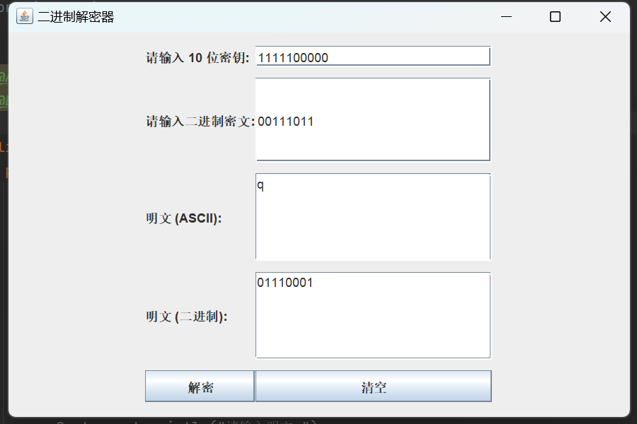

信息安全导论 作业一: S-DES算法实现

使用python实现S-DES算法，提供GUI解密支持用户交互。已完成基本测试，并拥有扩展功能，暴力破解功能。

1.基本测试
根据S-DES算法编写和调试程序, 提供GUI解密支持用户交互. 输入8bit的数据和10bit的密钥, 输出8bit的密文.

加密

解密

2.交叉测试

密钥：1111100000

明文：10101010

本程序得到的密文为：00111011

在别的组的程序中，运行结果如下图所示：

得到同一密文，交叉测试通过。

3.扩展功能

4.暴力破解

5.封闭测试

P10操作将第1索引下的元素挪到第2索引下;
Shift操作会将第1, 2索引下的元素挪到第0, 1索引下;
而P8操作不会使用第0, 1索引下的元素.
所以, 在两次子密钥的生成时不会用到原密钥第1索引下的元素,
对明文空间任意给定的明文分组, 不论原密钥第1索引下的元素是多少都会生成相同密文.
即对应明文空间任意给定的明文分组Pn, 会出现选择不同的密钥Ki != Kj加密得到相同密文Cn的情况.